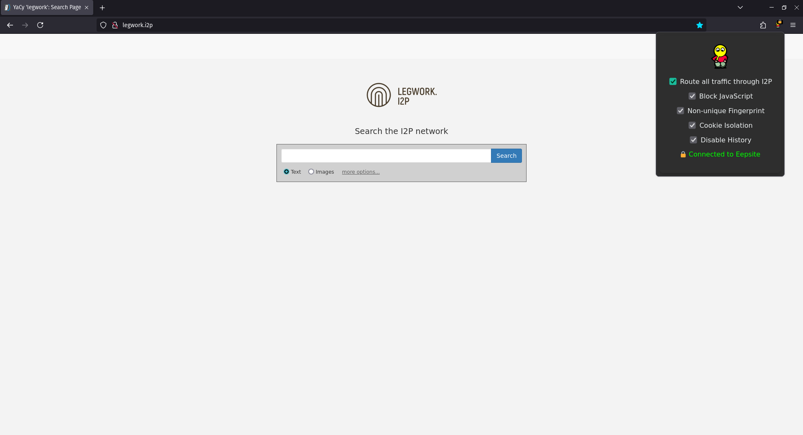
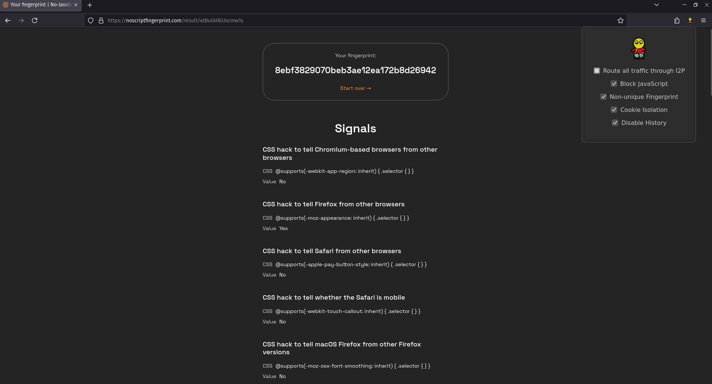
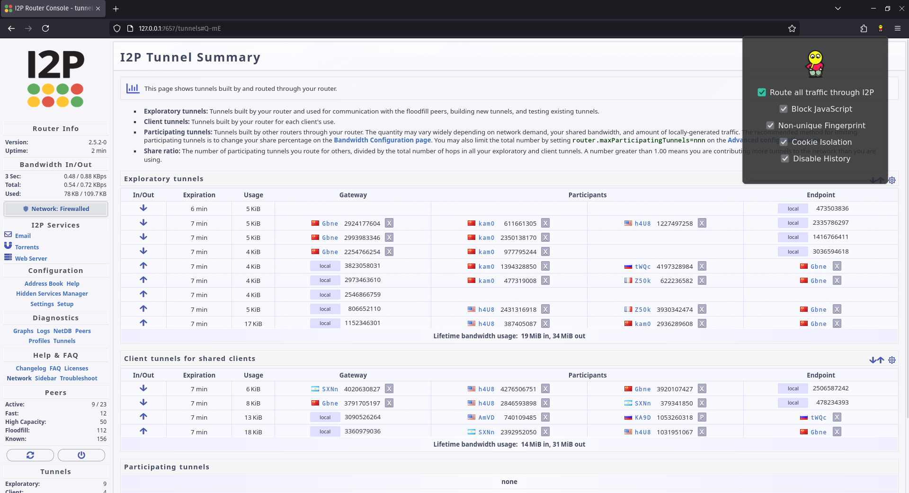

# I2Proxy
## A web browser extension for accessing I2P network anonymously
<!-- DESCRIPTION -->
## Description:

I2P, which stands for "Invisible Internet Project," is an anonymous network layer that allows for secure and private communication over the internet. It is designed to provide strong anonymity and privacy protections for its users. Unlike traditional internet connections, which expose your IP address and can be tracked, I2P routes traffic through a worldwide volunteer network of roughly 55,000 computers, known as routers. This ensures that your online activities are obscured and more difficult to trace.
I2Proxy is a web browser extension that is configured to proxy all traffic through the I2P network. By using I2Proxy, users can access websites and services hosted within the I2P network, known as "eepsites," with a high level of anonymity.

<!-- FEATURES -->
## Features:

- Optionally routes all browser traffic through I2P network
- Changes browser headers to specific values and blocks font API to prevent fingerprinting of users
- Cookie Isolation
- Blocks JavaScript
- No browsing history and cache
- I2P Proxy Killswitch (prevents data leaks)

<!-- INSTALLATION -->
## Installation:

[Mozilla Add-ons](https://addons.mozilla.org/en-US/firefox/addon/i2proxy/)

**Give all browser permissions including private browsing for full functionality**

<!-- REQUIREMENTS -->
## Requirements:

- [I2P Router](https://geti2p.net/en/download)

- [Firefox](https://www.mozilla.org/en-US/firefox/new/)

<!-- SCREENSHOTS -->
## Screenshots:

*Image 1: Legwork search engine and I2Proxy*

*Image 2: All users using this browser extension have the same [browser fingerprint](https://noscriptfingerprint.com/) to improve anonymity*

*Image 3: I2P Router Console and I2Proxy*

<!-- LICENSE -->
## License

Distributed under the MIT License. See `LICENSE` for more information.
